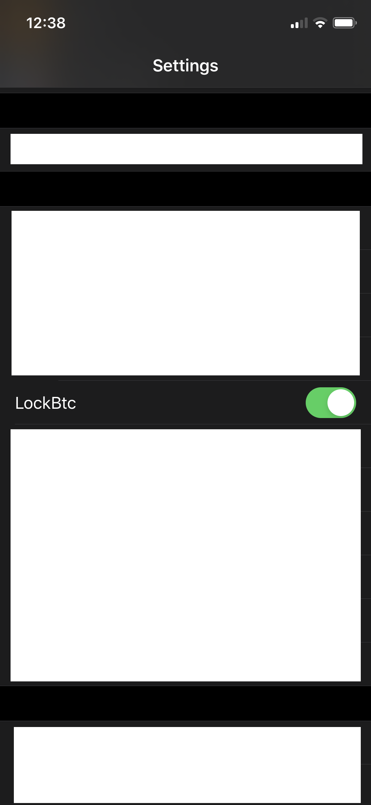

# lockbtc

Simple tweak that show the BTC price of coinbase.com in the lockscreen. It can be enabled and disabled.

# Issues
Since it is badly written, if there is no network or poor network the lockscreen will take a while to appear. The problem will be solved soon with the addition of additional currencies.